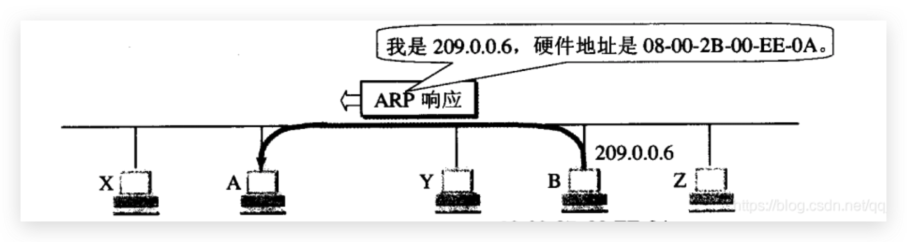

### 什么是ARP/RARP协议

ARP：通过IP地址找到对应主机的MAC地址
RARP：通过MAC地址找到对应主机的IP地址的

### 逆地址解析协议 RARP

逆地址解析协议RARP再过去有着重要的作用，但是现在的DHCP协议已经包含了RARP协议的功能，因此已经很少在单独使用RARP协议，逆地址解析协议的功能就是通过硬件地址解析出IP地址

### 地址解析协议 ARP

网络层使用的是IP协议，但是在实际网络的链路上传输数据的时候，最终还是必须使用该网络的硬件地址（MAC地址），因此当我们发送数据的时候就必须要知道目的端的物理地址，ARP协议就是根据目的端的IP地址获取硬件地址的协议

地址解析协议实现IP到MAC地址转换的方法就是：在主机ARP高速缓存中存放一个IP地址到硬件地址的映射表，并且这个映射表还会动态更新

每一个主机都设有ARP高速缓存（ARP cache），里面有本局域网上的各主机和路由器的IP地址到硬件地址的映射表，这些都是该主机目前知道的一些地址

### ARP 高速缓存表维护

当主机A要向当前局域网上的一个主机B发送IP数据报时，就先在其ARP高速缓存中查看有无主机B对应的硬件地址，如果有就查找出对应的硬件地址，再把这个硬件地址写入MAC帧中，然后将该MAC帧发送到主机B

但是ARP缓存表中可能并不能成功查找到主机B的硬件地址（主机B可能才刚刚进入当前局域网），这这种情况下主机A就会运行ARP程序，按照以下步骤找到主机B的硬件地址

ARP请求时以广播的方式发送，响应是以单播的方式回复，收到响应后会将IP地址和MAC地址的映射关系放入缓存中

**生存时间**

ARP为高速缓存中的每一个项映射都设置了一个生存时间，但凡是超过生存时间的项都会被删除

解决问题：假设某个设备的MAC地址发生了变化，如果缓存不过期就会导致获取不到正确的MAC地址

### ARP 解决的是同一个局域网的问题

APR协议解决的是同一个局域网上的主机或路由器IP地址和硬件地址的映射问题

如果要找的IP的发出ARP请求的主机不在同一个局域网中，对不起，ARP协议什么也做不了。

实际上也没必要这么做，两个不同局域网的主机进行通信时需要中间路由器的多次转发，因此我需要知道的是和我挨得最近的主机的硬件地址，这就是链路层的"一跳"

我们利用下图进行分析：
两个不同局域网的主机 H1 和 H2，主机H1想要发送数据给主机H2

1. 第一跳：主机H1将数据发送给路由器R1，主机H1通过ARP协议获取路由器R1的硬件地址，并发送数据帧
2. 第二跳：路由器R1将数据发送给路由器R2，路由器R1通过ARP协议获取到路由器R2硬件地址，并发送数据帧
3. 第三跳：路由器R2将数据发送给主机H2，路由器R2通过ARP协议获取到主机H2硬件地址，并发送数据帧

