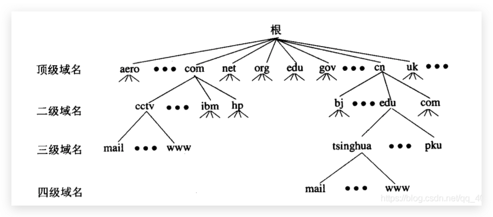
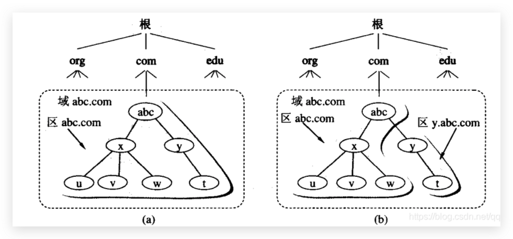
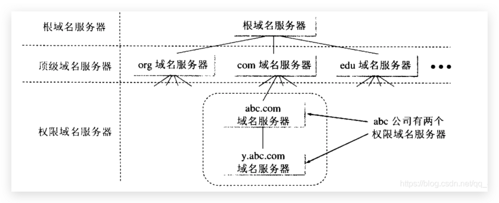
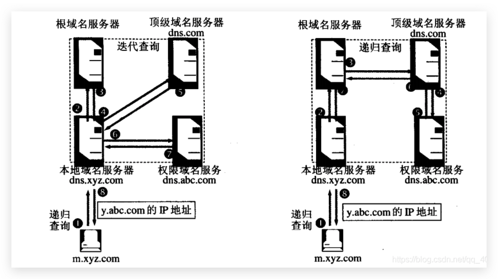

### hosts 文件

为了维护域名和IP地址的映射关系，早期使用的方法是每台主机上都有一个hosts文件，这个文件里面记录了映射关系，我们在浏览器输入域名，浏览器就会去hosts文件找到对应IP地址，从而进行访问

```shell
127.0.0.1		localhost
::1					localhost
```

### 因特网的域名结构

其中标号com是顶级域名、标号cctv是二级域名、标号mail是三级域名


- **顶级域名分为三大类：**
  1）国家顶级域名：cn代表中国、us代表美国、uk代表英国
  2）通用顶级域名：com公司企业、net网络服务机构、org非营利性组织
  3）基础机构域名：arpa反向域名

- **我国把二级域名划分为类别域名和行政区域名：**
  1）类别域名：com工商金融等企业、gov政府机构、org非营利性组织
  2）行政区域名：bj北京市、js江苏省

用域名树表示因特网的域名系统：



### 域名服务器

实际上一个DNS服务器的管辖范围并不是以域为单位，而是以区为单位，区是DNS服务器的实际管辖范围，区可能小于域，但一定不可能大于域



1. 根域名服务器：所有的根域名服务器都知道所有的顶级域名服务器的域名和IP地址。根域名服务器是最重要的域名服务器，因为任何的本地域名服务器当不能解析域名的时候，必须要向根域名服务器进行求助，假设所有的根域名服务器都出现问题，那么整个因特网也就瘫痪了。
2. 顶级域名服务器：顶级域名服务器负责管理在自己下面注册的所有二级域名服务器，当收到DNS请求时会做出相应应答
3. 权限域名服务器：权限域名服务器就是负责一个区的域名服务器，当权限域名服务器还不能给出查询结果时，会告诉发出查询请求的DNS用户，下一步去找哪个权限域名服务器
4. 本地域名服务器：当一个主机发出DNS请求时，这个查询请求报文就是发送给了本地域名服务器，



### 域名解析过程

- 递归查询

  主机向本地域名服务器的查询一般都是采用递归查询，递归是指如果本地域名服务器不知道被查询域名的IP地址，本地域名服务器就成为了一个新的DNS客户，代替主机进行查询，最后返回查询结果

- 迭代查询

  本地域名服务器向其他DNS服务器的请求采用迭代查询，迭代查询是指当根据域服务器接收到本地域名服务器发送的迭代查询请求报文后时，要么给出所查询的IP地址，要么告诉服务器"你下一步应该到哪个顶级域名服务器进行查询"，然后本地域名服务器亲自去顶级域名服务器查询。本地域名服务器也可以采用递归查询



### 为提高效率的高速缓存

为了提高DNS的查询效率，减轻根域名服务器的负荷，并减少因特网上DNS查询数据报的数量，在域名服务器中使用了高速缓存，高速缓存是用来存放最近查询过的域名以及从何处获取域名映射信息的记录

在上述查询过程中，假设不久前已经有其他用户查询过域名为y.abc.com的IP地址，那么当我查询的时候，本地域名服务器就不必要向根域名服务器重新查询，只需要将高速缓冲中上次的查询结果告诉我

或者本地域名服务器中并没有y.abc.com的IP地址，但是存放着顶级域名服务器dns.com的IP地址，那么同样不需要向根域名服务器查询，只需要直接向顶级域名服务器进行查询

高速缓存存在着一定的声明周期，一旦超过了声明周期，就需要向根域名服务器重新请求
