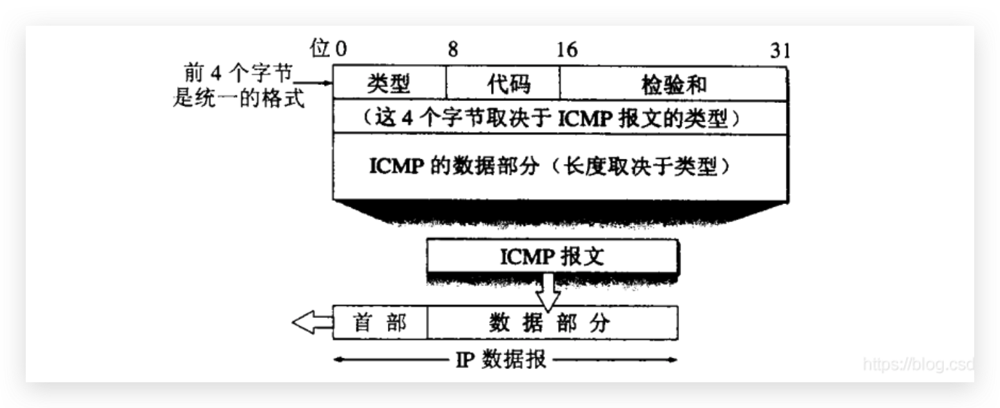
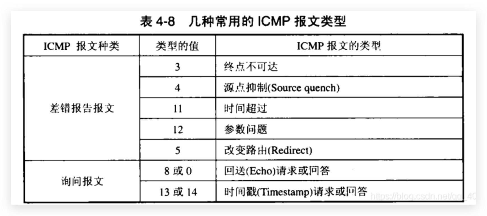
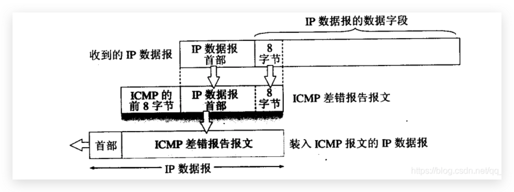

ICMP协议是IP协议的附属协议，由于IP协议并不提供可靠传输，即使数据丢失了也不知道。为了提高IP数据报的交付成功的机会，在网络层提供了ICMP协议，在IP丢包的时候ICMP可以告诉源主机丢包的原因

### 报文种类

1. ICMP差错报文
2. ICMP询问报文

ICMP报文的前4个字节是统一的格式，共有三个字段：类型、代码、校验和。接着四个字节和ICMP类型有关，最后面是数据字段，长度取决于ICMP报文类型



### 差错报文

ICMP数据部分：IP数据包首部+IP数据段前8个字节（获取端口号和发送序号）



### 询问报文

1. 回送请求与回答报文，主机或路由器向一个特定的目的主机发出的询问，收到请求的主机必须给发送请求的主机或路由器发送ICMP回送回答报文。这种询问用于测试目的站是否可达以及了解有关状态
2. 时间戳请求与回答报文，请求某个主机或路由器回答当前的日期和时间，可用来进行时钟同步和测量时间

### Ping

ping用于测试两个主机之间的连通性。ping使用的就是ICMP询问报文中的回送请求与回答报文，ping应用程序并不经过传输层，而是应用层直接使用网络层

```shell
λ ping baidu.com
PING baidu.com (220.181.38.251) 56(84) bytes of data.
64 bytes from 220.181.38.251: icmp_seq=1 ttl=47 time=40.3 ms
64 bytes from 220.181.38.251: icmp_seq=2 ttl=47 time=40.3 ms
64 bytes from 220.181.38.251: icmp_seq=3 ttl=47 time=40.3 ms
64 bytes from 220.181.38.251: icmp_seq=4 ttl=47 time=40.3 ms
^C
--- baidu.com ping statistics ---
4 packets transmitted, 4 received, 0% packet loss, time 3001ms
rtt min/avg/max/mdev = 40.340/40.356/40.385/0.143 ms
```

### traceroute

用来跟踪一个Ip数据报从发送端到服务器的路径

traceroute从源主机向目的主机发送一连串的IP数据报，数据报中封装的是无法交付的UDP数据报。

设置第一个IP数据报的TTL=1，当IP数据报到达路径上的第一个路由器后（第一跳）TTL-=1，由于TTL为0，因此路由器将IP数据报丢弃并向源主机发送`ICMP时间超时`差错报告报文

源主机收到ICMP差错报告报文后，发送第二个IP数据报，这时TTL=2，同样经过两跳后TTL变为0，路由器将IP数据报丢弃并向源主机发送`ICMP时间超时`差错报告报文

一直重复此步骤，直到TTL的大小可以让数据递达目的端，此时由于IP数据报中封装的是不可交付的UDP数据报，因此目的主机向源主机发送`ICMP终点不可达`差错报告报文
