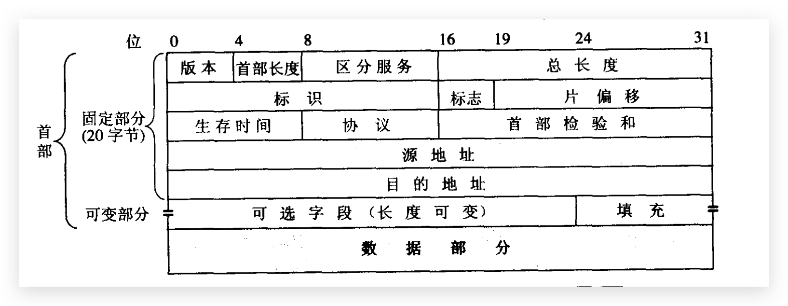
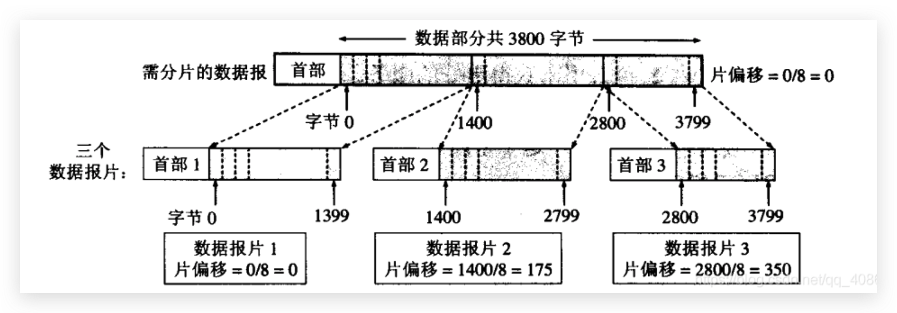

### 格式

```shell
- 版本号：执行IP协议版本，对于IPv4来说是4
- 首部长度：表示IP头部占用长度，单位是4Bytes，最常长度值为15 * 4Bytes = 60Bytes
- 服务类型：其中4位TOS字段，分别表示：`最小延时、最大吞吐量、最高可靠性、最小成本`，四个选项相互冲突只能选择一个，且只是意愿
- 总长度：最大65535Bytes。链路层有自己的帧格式，其中帧数据的最大长度称为`MTU最大传送单元`，当总长度超过了MTU时需要进行分片处理才能进行发送，此时IP数据报首部的总长度指的是分片以后的首部及数据的长度总和
- 标识：IP软件维持一个计数器，每产生一个IP报文计数器加一，用于标识IP报文（分片后组装使用）
- 标志：`MF=1`表示后面还有分片，`MF=0`表示当前是最后一个分片；`DF=1`表示不能进行分片
- 片偏移：分片相对于原始IP报文开始处的偏移，实际偏移字节数是这个值*8得到，因此除了最后一个报文其他报文长度必须是8的整数倍
- 生存时间(TTL)：数据报到达目的地的最大报文跳数，最大是255，每次经过一跳TTL减1，一直减到0还没到达，丢弃报文并返回ICMP终点不可达的差错报告报文，可以防止路由循环
- 协议：指出数据报携带的数据用的哪种上层协议（IMCP、TCP、UDP、OSPF）
- 首部校验和：只校验数据报的首部，不包括数据部分，数据部分由传输层进行校验
- 源地址/目的地址
```

### 分片案例

一个IP数据报的总长度为3820字节，数据部分为3800字节，MTU为1420。
因固定首部长度20字节，因此每个数据报片的数据长度不能超过1400字节，于是分为3个数据分片，数据部分的长度分别为 1400、1400、1000字节，原始数据报的首部被复制作为各数据报片的首部，但是必须修改有关字段的值（例如总长度、片偏移）



### IP地址不够用的解决方案

1. 动态分配，联网分配，不联网则不分配
2. NAT机制，内网IP用于局域网通信，与外部的通信则统一经过NAT路由器外网IP
3. IPv6（128bit）

### MAC 地址

一般都是在网卡出厂时就确定不可以更改的地址，6Bytes大小，用十六进制表示冒号隔开：`00:0E:FA:03:90`