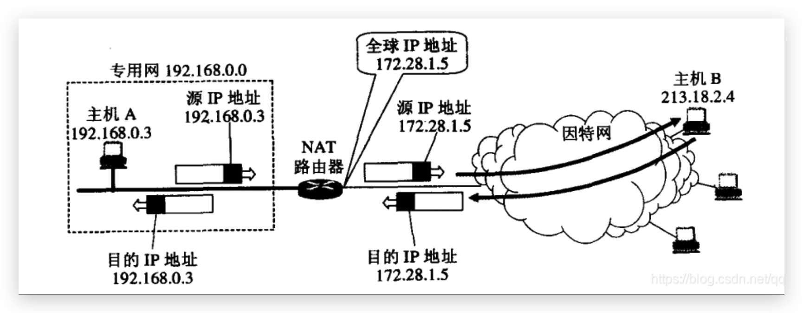
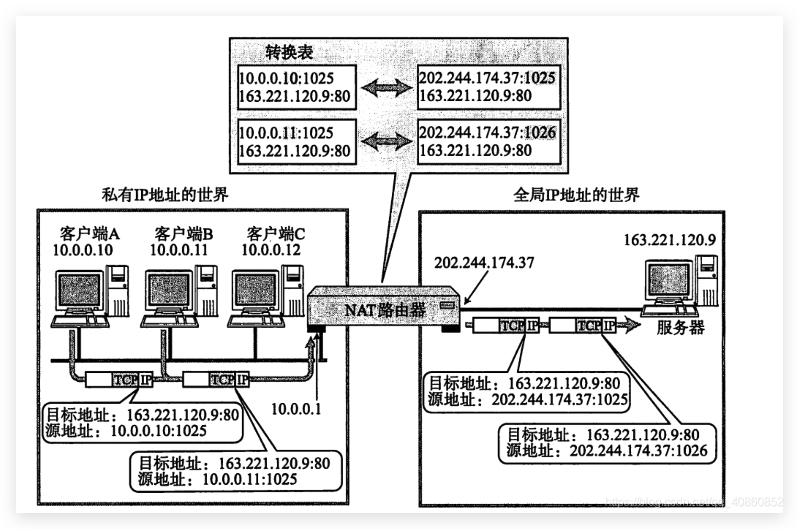

### 地址转换

NAT地址转换技术要求连接到因特网的路由器上安装NAT程序（没连接到因特网自然就不用）

装有NAT软件的路由器叫又做NAT路由器，NAT路由器至少有一个公有IP。所有使用本地地址的主机想要和外界进行通信时，都要在NAT路由器上将本地地址转换为公有IP，才能和外网进行通信

### NAPT

NAT路由器怎么知道回复的数据包应该交给哪个客户端？NAPT就是解决这个问题的

这时在重新看另一张图，私有IP世界的客户端A和客户端B都想发送数据给`163.221.120.9`，于是在NAT路由器中将他们的私有IP转换为公有IP，并通过端口号的方式来区分是哪个主机在发送数据

> 10.0.0.10:1025  ==>  202.244.174.37:1025
> 10.0.0.11:1025  ==>  202.244.174.37:1026

当NAT路由器收到主机`163.221.120.9`回复的数据时，就可以通过转换表中的映射关系来确定应该将数据交给局域网的哪台主机。

### 依赖路由表带来的问题

1. 无法从NAT外部向局域网内部建立连接
2. 转换表的生成与转换操作会带来一定的开销
3. 通信过程中一旦NAT路由器异常，局域网和NAT外部建立的所有连接都将断开
