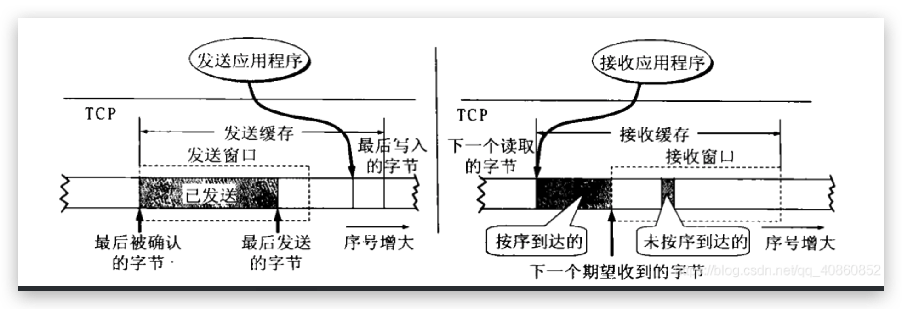
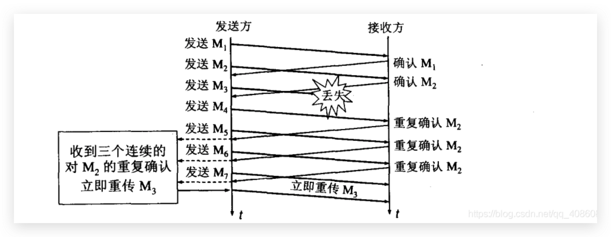

## 传输控制协议

***

```shell
序号：TCP传输的字节流的每个字节都按顺序编号，三次握手时确定字节流的起始序号
确认号：对方下个TCP报文的其实序号
数据偏移：首部长度。四个Bit最大表示15，单位是4Bytes，因此TCP首部最大占60Bytes
保留：6Bit
标志位：
	- URG：紧急报文
	- ACK：确认报文
	- PSH：提示对方尽快将数据从缓冲区取走
	- RST：复位报文段
	- SYN：同步报文段
	- FIN：结束报文段
窗口：发送方的接收窗口大小，对方设置发送窗口的依据
校验和：校验首部和数据
紧急指针：`URG==1`时才有意义，指定紧急数据的字节数（紧急数据后才是普通数据）
选项：长度可变，最常40Bytes
```

### 特点

```shell
面向连接
提供可靠传输：无差错、不丢失、不重复、按序到达
全双工通信
面向字节流
```


## 确认应答&超时重传

***

服务器A发送给B的数据会被放入TCP发送缓冲区中，直到收到对应的ACK应答，才会将数据删除。

当长时间未接收到ACK（大于超时时间），会触发超时重传。

TCP采用一种自适应算法，它记录每一个报文段发出的时间，以及收到相应确认的时间，两个时间差就是报文段往返时间`RTT`。TCP保留RTT的一个加权平均时间`RTTS`，RTTS的值时刻在发生变化，而超时重传时间就根据这个加权平均时间RTTS来确定，比这个值大一点

**情况1：**


**情况2：**


## 三次握手&四次挥手

***


**为什么不是两次：**

1. 防止丢失的请求连接报文，再次抵达服务器，建立连接浪费资源
2. 三次握手过程中需要互相协商一些信息：各自的报文起始序号...


等待计时器：控制TIME_WAIT的时间，确保对方正确接收到ACK

包活计时器：超过一段时间时间没有收到数据，这种发送一个保活探测包，连续多个无响应则认为挂了，主动关闭连接。每当接收到数据包时重置计时器


## 滑动窗口

***

滑动窗口以字节为单位，支持一次发送多条数据只需一次应答（不必等待每一个应答），从而提高发送效率。

发送窗口表示在没有收到对方ACK应答前，允许发送的数据内容，只有接收到对应ACK的数据才会从滑动窗口中删除，窗口前移。

如图：后沿后边的数据表示已经发送且收到ACK，这些数据即将从窗口中删除。前沿前边的数据是窗口外的数据，不允许发送。


如图对于A的发送窗口：小于P1的是已经发送并已经收到ACK的数据；大于P3的是不允许发送的数据；P1-P2窗口大小（通知窗口）；P1-P2 已经发送但是尚未收到ACK的数据；P2-P3允许发送但是还没有发送的数据（可用窗口）


再看B的接收窗口，窗口大小20，到30号为止的数据已经回复ACK，并且交付给主机。接收窗口内（31-50）是允许接受的数据。在上图中B接收到了32 33号数据，但是31号数据并没有接收到（未按序到达）。因此B回复的ACK会一直向A请求数据31，而不会回复32-32已经送达。因为主机只对按序接收到的数据中最高序号给出确认，因此回复的确认报文段中确认号一直是31。

收到31号数据后，将31-33号数据交给主机，此时滑动窗口向后滑动3个字节，并回复ACK直接请求序号为34的数据。

发送缓存中存在的数据：

1. 发送方应用程序拷贝到TCP内核缓冲区，准备发送的数据
2. 已经发送但是尚未收到ACK应答的数据

接收缓存中存在的数据：
1. 按序到达，但尚未被应用程序读取的数据
2. 未按序到达的数据

如果接受应用程序来不及处理数据，接受缓冲区将会被填满，接收窗口将会减小到0。相反如果接收应用程序能够及时的处理数据，接收窗口就会增大，最大不会超过接受缓冲区的大小。




接收端对于不按序到达的数据先临时保存在窗口中，等到缺少的字节全部接收后，在按序交给应用进程。

TCP接受方具有累积确认的功能（很多字节回复一个ACK），也可以在自己数据要发送的时候把ACK顺便捎带上（捎带应答机制）。但是接收方不应过分推迟ACK应答，否则可能造成不必要的重传。捎带应答实际上并不经常发生，必须是通信双方同时给对方发送数据。

**丢包如何重传：**

- 情况一：主机B接收到了数据，但是回复的ACK包丢失
  这种情况下部分包丢失并没有关系，不用重传。假设发送了`1-10`ACK丢失，发送了`11-20`ACK应答正常，说明`1-10`数据已经被正常接收。因为接收主机只对按序接收到的数据中最高序号给出确认，如果未接到`1-10`数据就会一直回复索要`1-10`数据的ACK，而不会正常回复`11-20`数据对应的ACK应答。

- 情况二：主机A发送的数据包直接丢失，主机B没有接收到数据
  假设`1-10`数据包丢失，那么主机B每收到一个乱序的数据报，就会回复ACK索要`1-10`数据包，一旦主机A收到三次相同的ACK应答将会重传，这种方式被称为 "快速重发机制" （也叫"快重传"），相比于超时应答要快很多。


## 流量控制

***

流量控制即发送端根据接收端的处理数据的能力（接收缓冲区剩余大小），来确定发送缓冲区大小


接收端会将自己缓冲区剩余大小放入TCP首部的"窗口大小"字段，通过ACK通知发送端，窗口大小越大说明网络吞吐量越大，接收端一旦发现自己的缓冲区快满了就会将"窗口大小"字段设置为一个较小的值，通知发送端，发送端得知"窗口大小"的值比较小后，会减慢发送的速率，一旦"窗口大小"为0，说明接受缓冲区满了，停止发送。

停止发送后，会等待接收端发送窗口更新通知，但是窗口更新通知如果丢包了，就不能正常发送了，因此，发送端会定时发送一个窗口探测包，来获知"窗口大小"从而断定是否开始发送数据。


## 拥塞控制

***

拥塞控制即根据网络拥塞程序来确定发送窗口的大小

**慢启动：**

默认认为网络堵塞，每次开始发送都会将拥塞窗口设置为1，如果正确接收到ACK应答拥塞窗口将以指数级别增长

慢启动虽然启动慢，但是指数增长速度很快，于是定义了一个阈值，一旦拥塞窗口大小超过阈值，将会变为线性增长。拥塞窗口的阈值最开始就是滑动窗口的最大值，一旦发生丢包阈值减半且拥塞窗口置为1，重新慢启动


**快重传：**

接收方每当收到一个失序报文段，就会回复一个ACK索要下一个应该到达的数据

发送方连续三次接收到同一个ACK报文段，则会对该数据进行重传，不必等待超时重传从而提高效率



**快恢复：**

快恢复是指，当发生丢包时将慢启动阈值减半后，不执行慢启动算法，而是使用快恢复算法替代，将拥塞窗口大小设置为慢启动阈值的一半，从而减少了恢复时间，提高传输效率


## 延迟应答&捎带应答

***

**延迟应答**

和滑动窗口密切相关，给接收方一定的时间处理数据，这样应答返回的空间大小就会更大

假设接收端缓冲区为1M，一次接收到了 500K 的数据，如果立刻应答，返回的窗口大小就是 500K
但是接收端可能处理数据的能力很强，很短的时间就将数据处理完毕，这时再进行应答那么返回的窗口就是1M，这种情况下即使窗口在大些，接受端依旧能处理的过来

但是也不是每个包都需要进行延迟应答
1. 数量限制：每隔 N 个包就应答一次
2. 时间限制：每当超出最大延迟时间就应答一次

**捎带应答**

延迟应答的基础上，引入捎带应答机制

很多情况下客户端给服务端发送了数据，服务端也同样会给客户端回复数据，那么此时 ACK 就可以搭一个顺风车，和回复的数据一起发送，例如当两台主机同时时刻给对方发送数据的时候。


## 面向字节流

***

创建一个TCP socket，同时在内核中创建发送缓冲区和接收缓冲区

发送数据时会先将数据放到发送缓冲区中，如果发送的数据太多拆分成多个TCP包进行发送，如果数据太少，就会先等待其他数据。接收数据时，数据从网卡到达内核的接收缓冲区中，然后程序从接受缓冲区中取数据。

正是由于缓冲区的存在，应用层交付的100个字节的数据我可以选择一次性全部发送，也可以一次1个字节发送100次，接收的时候也可以一次全部接受，也可以多次接收，所以 TCP 的一个特点就是面向字节流。

**面向字节流带来的粘包问题：**

粘包问题中的"包"是应用层的数据包，在TCP协议头部中没有像UDP一样有一个字段表示报文长度，因此就不知道发送的数据到底有多长，但是TCP有一个表示序号的字段。站在传输层的角度，数据是编好序别放到了接受缓冲区中。

站在应用层的角度，数据只是一串连续的字节数据，那么应用程序看到这么一串数据，就不知道从哪个位置到哪个位置是一个完整的应用层数据包。

- 对于定长的数据包，我们只需要保证每次都以相同的长度从接受缓冲区中读取即可
- 对于变长的数据包，我们可以在数据包的头部，约定一个字段表示数据包的总长度
- 我们还可以在包与包之间用分割符分割开，分隔符协议由应用层自己实现


## 总结

***

```shell
可靠性：
	- 确认应答
	- 超时重传
	- 连接管理
传输效率：
	- 滑动窗口（基石）
	- 流量控制
	- 拥塞控制
	- 延迟应答
	- 捎带应答
```