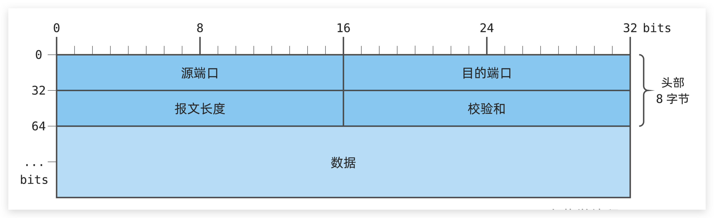
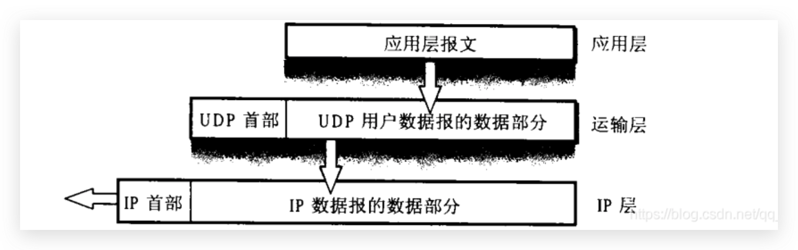

### 用户数据报协议

```shell
UDP长度：协议报头和数据部分的整体长度，最大理论值64K（受到MSS影响，远远达不到64K）
CRC校验（循环冗余校验码）
```

### UDP 特点

```shell
无连接：知道对端的ip和端口号，即可传输
不可靠：没有确认应答、重传，丢包也不会有错误信息显示
面向数据报：发送方对于应用层交付的数据直接添加首部后就向下交付给网络层，既不拆分也不合并，一次发送一个报文

适用于直播、视频通话等实时性高的场景，传输速度快
但是UDP在丢包的情况下继续发送，会加剧网络的阻塞，有时也需要拥塞控制一下
```



### UDP 缓冲区

1. 没有发送缓冲区：要发送的数据直接交给内核，由内核将数据传给网络层进行后续的传输动作
2. 存在接收缓冲区：不保证接数据报的顺序一致性，且一旦缓冲区满将会发生丢包