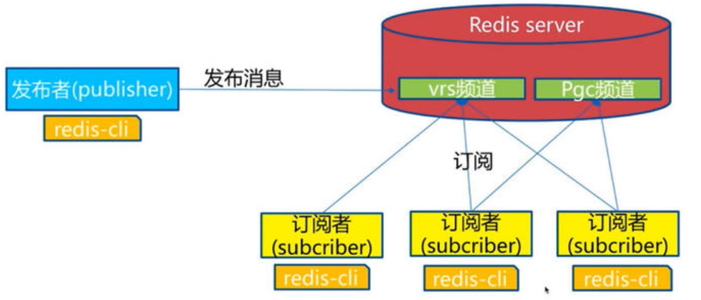

# NoSQL 概述

## NoSQL 特点

1. 方便扩展（数据之间没有关系！）
2. 大数据量高性能（Redis 一秒写8万次，读取11万次，NoSQL的缓存记录级，是一种细粒度的缓存，性能会比较高！）
3. 数据类型是多样型的！（不需要实现设计数据库！随去随用！）
4. 传统的 RDBMS 和 NoSQL

```shell
传统的 RDBMS:
- 结构化组织
- SQL
- 数据和关系都存在单独的表中
- 严格的一致性
- 基础的事务
...
```

```shell
NoSQL:
- 不仅仅是数据
- 没有固定的查询语言
- 键值对存储，列存储，文档存储，图形数据库（社交关系）
- CAP定理 和 BASE
- 高性能，高可用，高可扩
...
```

## NoSQL 四大分类

**KV键值对：**

- Redis

**文档型数据库（bson格式 和json一样）:**

- MongoDB
  - MongoDB 是一个基于分布式文件存储的数据库，C++编写，主要用来处理大量的文档！
  - MongoDB 是一个介于关系型数据库和非关系型数据库中间的产品！MongoDB 是非关系型数据库中功能最丰富，最像关系型数据库的！
- ConchDB

**列存储数据库:**

- HBase
- 分布式文件系统

**图关系数据库:**

- 它放的不是图形，放的是关系，比如：朋友圈社交网络，广告推荐等！
- Neo4j，InfoGrid

# Redis 入门

## 概述

> Redis 是什么？

Redis（Remote Dictionary Server），即远程字典服务

是一个开源的使用ANSI [C语言](https://baike.baidu.com/item/C语言)编写、支持网络、可基于内存亦可持久化的日志型、Key-Value[数据库](https://baike.baidu.com/item/数据库/103728)，并提供多种语言的API。

Redis会周期性的把更新的数据写入磁盘或者把修改操作写入追加的记录文件，并且在此基础上实现了master-slave(主从)同步。

> Redis 能干嘛？

1、内存存储，持久化。

2、效率高，可以用于高速缓存。

3、发布订阅系统。

4、滴入信息分析。

5、定时器，计数器（浏览量！）

6、......

> 特性

1、多样的数据类型

2、持久化

3、集群

4、事务

5、......

## Linux 下安装

redis 默认不是后台启动的，修改配置文件将 daemonize no 改为 yes

```shell
λ redis-server redis.conf     # 使用自己的配置文件
λ redis-cli -p 7379           # 连接:6379 默认端口号
127.0.0.1:6379> ping
PONG
127.0.0.1:6379> set name fuck
OK
127.0.0.1:6379> get name
"fuck"
127.0.0.1:6379> keys *
1) "name"
127.0.0.1:6379> shutdown
not connected> exit
```

## redis-benchmark
redis-benchmark 是一个压力测试工具！
```shell
# 测试: 100个并发连接，10万个请求
λ redis-benchmark -h localhost -p 6379 -c 100 -n 100000
...
100.00% <= 2 milliseconds
78247.26 requests per second

====== SET ======
  100000 requests completed in 1.24 seconds    ## 对10万个请求进行写入测试
  100 parallel clients                         ## 100个并发连接
  3 bytes payload                              ## 每次写入3个字节
  keep alive: 1                         ## 只有一台服务器来处理这些请求,单机性能
  host configuration "save": 900 1 300 10 60 10000
  host configuration "appendonly": no
  multi-thread: no

97.93% <= 1 milliseconds
99.94% <= 2 milliseconds
100.00% <= 3 milliseconds
80971.66 requests per second                   ## 每秒处理的请求数量

====== GET ======
  100000 requests completed in 1.27 seconds
  100 parallel clients
  3 bytes payload
  ...
```

## 基础知识
> Redis 有16个数据库, 默认使用第0个。

```shell
127.0.0.1:6379> select 3          ## 切换数据库
OK
127.0.0.1:6379[3]> DBSIZE         ## 查看数据库大小
(integer) 0
127.0.0.1:6379[3]> SET name fuck
OK
127.0.0.1:6379[3]> KEYS *         ## 查看所有的key
1) "name"
127.0.0.1:6379[3]> FLUSHDB        ## 清空当前数据库
OK
127.0.0.1:6379[3]> KEYS *
(empty array)
127.0.0.1:6379[3]> FLUSHALL       ## 清空全部数据库
OK
127.0.0.1:6379> move name 1       ## 删除
(integer) 1
127.0.0.1:6379> EXISTS name       ## 判断是否存在
(integer) 0
127.0.0.1:6379> EXPIRE name 5     ## 设置数据的过期时间
(integer) 1
127.0.0.1:6379> ttl name          ## 查看剩余的过期时间
127.0.0.1:6379> TYPE name         ## 查看数据类型
string
```

> Redis 是单线程的!

Redis是很快的，官方表示，Redis是基于内存的操作，CPU并不是Redis的性能瓶颈，Redis的瓶颈是根据机器的内存和网络带宽，既然可以使用单线程来实现，就使用单线程了！

Redis 是 C 语言写的，官方提供的数据为 100000+ QPS，完全不比同样是使用key-value的Memecache差！

> Redis 为什么单线程还这么快？

核心: Redis 是将所有的数据全部放在内存中的，所以说使用单线程效率就是最高的，多线程会存在CPU上下文切换，反而耗时。对于内存系统来说，如果没有上下文切换，那么效率就是最高的！

# 五大数据类型
## String（字符串）

```shell
###################################################################################
127.0.0.1:6379> SET key1 v1
OK
127.0.0.1:6379> GET key1
"v1"
127.0.0.1:6379> APPEND key1 "hello"           ## 追加,如果不存在就相当于set key
(integer) 7
127.0.0.1:6379> GET key1
"v1hello"
127.0.0.1:6379> STRLEN key1                   ## 获取长度
(integer) 7
###################################################################################
127.0.0.1:6379> SET views 1
OK
127.0.0.1:6379> GET views
"1"
127.0.0.1:6379> INCR views                ## views++
(integer) 2
127.0.0.1:6379> INCR views
(integer) 3
127.0.0.1:6379> INCRBY views 5            ## views+=5
(integer) 8
127.0.0.1:6379> DECR views                ## views--
(integer) 7
127.0.0.1:6379> DECRBY views 3            ## views-=3
(integer) 4
127.0.0.1:6379> GET views
"4"
###################################################################################
127.0.0.1:6379> SET key1 "what the fuck!"
OK
127.0.0.1:6379> GET key1
"what the fuck!"
127.0.0.1:6379> GETRANGE key1 0 3         ## 截取 [0,3]
"what"
127.0.0.1:6379> GETRANGE key1 0 -1        ## 截取全部字符串
"what the fuck!"
127.0.0.1:6379> SETRANGE key1 9 shit      ## 从第9个字符开始替换
(integer) 14
127.0.0.1:6379> GET key1
"what the shit!"
###################################################################################
# setex(set with expire)   # 设置过期时间
# setnx(set if not exist)  # 不存在则设置
127.0.0.1:6379> setex key3 30 "hello"
OK
127.0.0.1:6379> TTL key3
(integer) 25
127.0.0.1:6379> GET key3
"hello"
127.0.0.1:6379> KEYS *
1) "key3"
2) "mykey"
3) "key1"
127.0.0.1:6379> TTL key3
(integer) -2
127.0.0.1:6379> KEYS *
1) "mykey"
2) "key1"
127.0.0.1:6379> SETNX mykey "MongoDB"    ## mykey已经存在, 0:表示设置失败
(integer) 0
127.0.0.1:6379> GET MYKEY
"redis"
###################################################################################
127.0.0.1:6379> MSET k1 v1 k2 v2           ## 批量设置多个值
OK
127.0.0.1:6379> MGET k1 k2                 ## 批量获取多个值
1) "v1"
2) "v2"
127.0.0.1:6379> MSETNX k1 v1 k3 v3
(integer) 0
127.0.0.1:6379> GET k3                     ## MSETNX是原子操作
(nil)

# 这里的key是一个巧妙的设计:  user:{id}:{age}
127.0.0.1:6379> mset user:1:name fuck user:1:age 20
OK
127.0.0.1:6379> mget user:1:name user:1:age
1) "fuck"
2) "20"
###################################################################################
# getset 先 get 在 set
127.0.0.1:6379> GETSET db redis          ## 如果不存在就返回nil，并设置新的值
(nil)
127.0.0.1:6379> GET db
"redis"
127.0.0.1:6379> GETSET db mongodb        ## 如果存在，就返回原来的值，并设置新的值
"redis"
127.0.0.1:6379> GET db
"mongodb"
###################################################################################
```

## List
> 本质上是一个链表

```shell
###################################################################################
127.0.0.1:6379> LPUSH list one          ## 头插
(integer) 1
127.0.0.1:6379> LPUSH list two
(integer) 2
127.0.0.1:6379> LPUSH list three
(integer) 3
127.0.0.1:6379> RPUSH list right        ## 尾插
(integer) 4
127.0.0.1:6379> LRANGE list 0 -1
1) "three"
2) "two"
3) "one"
4) "right"
127.0.0.1:6379> LPOP list               ## 头删
"three"
127.0.0.1:6379> RPOP list               ## 尾删
"right"
###################################################################################
127.0.0.1:6379> LRANGE list 0 -1
1) "two"
2) "one"
127.0.0.1:6379> LINDEX list 0           ## 获取对应下标的值
"two"
###################################################################################
127.0.0.1:6379> LLEN list               ## 获取长度
(integer) 2
###################################################################################
127.0.0.1:6379> LPUSH list one
(integer) 3
127.0.0.1:6379> LRANGE list 0 -1
1) "one"
2) "two"
3) "one"
127.0.0.1:6379> LREM list 2 one             ## 删除两个 "one", 根据value来删除
(integer) 2
127.0.0.1:6379> LRANGE list 0 -1
1) "two"
###################################################################################
127.0.0.1:6379> RPUSH list 1
(integer) 2
127.0.0.1:6379> RPUSH list 2
(integer) 3
127.0.0.1:6379> RPUSH list 3
(integer) 4
127.0.0.1:6379> LRANGE list 0 -1
1) "two"
2) "1"
3) "2"
4) "3"
127.0.0.1:6379> LTRIM list 1 2              ## 截断 [1,2]
OK
127.0.0.1:6379> LRANGE list 0 -1
1) "1"
2) "2"
###################################################################################
127.0.0.1:6379> LRANGE list 0 -1
1) "1"
2) "2"
127.0.0.1:6379> RPOPLPUSH list list2        ## 从list的右侧删除，添加到list2的左侧
"2"
127.0.0.1:6379> LRANGE list 0 -1
1) "1"
127.0.0.1:6379> LRANGE list2 0 -1
1) "2"
###################################################################################
127.0.0.1:6379> LSET list 0 10000           ## 更改指定下表对应的值
OK
127.0.0.1:6379> lrange list 0 0
1) "10000"
127.0.0.1:6379> lset list 1 10000           ## 超出范围，报错
(error) ERR index out of range
###################################################################################
127.0.0.1:6379> LRANGE list 0 -1
1) "10000"
127.0.0.1:6379> LINSERT list BEFORE 10000 hello    ## 在指定value前插入
(integer) 2
127.0.0.1:6379> LINSERT list AFTER 10000 world     ## 在指定value后插入
(integer) 3
127.0.0.1:6379> lrange list 0 -1
1) "hello"
2) "10000"
3) "world"
###################################################################################
```

## Set
> Set 中的值不能重复

```shell
###################################################################################
127.0.0.1:6379> SADD myset "hello"                ## 添加
(integer) 1
127.0.0.1:6379> SADD myset "world"
(integer) 1
127.0.0.1:6379> SADD myset "the"
(integer) 1
127.0.0.1:6379> SMEMBERS myset                    ## 查看所有
1) "hello"
2) "world"
3) "the"
127.0.0.1:6379> SISMEMBER myset hello             ## 判断是否存在
(integer) 1
127.0.0.1:6379> SISMEMBER myset fuck
(integer) 0
###################################################################################
127.0.0.1:6379> SCARD myset                       ## 查看元素个数
(integer) 3
127.0.0.1:6379> SREM myset the                    ## 移除指定元素
(integer) 1
127.0.0.1:6379> SMEMBERS myset
1) "hello"
2) "world"
###################################################################################
127.0.0.1:6379> SMEMBERS myset
1) "hello"
2) "world"
127.0.0.1:6379> SRANDMEMBER myset                 ## 无序不重复集合,抽随机(1个)
"world"
127.0.0.1:6379> SRANDMEMBER myset
"world"
127.0.0.1:6379> SRANDMEMBER myset
"hello"
127.0.0.1:6379> SRANDMEMBER myset 2               ## 2个
"hello"
###################################################################################
127.0.0.1:6379> spop myset                        ## 随机移除
"world"
127.0.0.1:6379> SMEMBERS myset
1) "hello"
###################################################################################
127.0.0.1:6379> sadd myset hello
(integer) 1
127.0.0.1:6379> sadd myset world
(integer) 1
127.0.0.1:6379> sadd myset the
(integer) 1
127.0.0.1:6379> sadd myset2 set2
(integer) 1
127.0.0.1:6379> smove myset myset2 the           ## 移动制定的元素
(integer) 1
127.0.0.1:6379> SMEMBERS myset
1) "hello"
2) "world"
127.0.0.1:6379> SMEMBERS myset2
1) "set2"
2) "the"
###################################################################################
127.0.0.1:6379> SADD myset a b c
(integer) 0
127.0.0.1:6379> SADD myset2 c d e
(integer) 3
127.0.0.1:6379> SDIFF myset myset2               ## 差集
1) "b"
2) "a"
127.0.0.1:6379> SDIFF myset2 myset
1) "d"
2) "e"
127.0.0.1:6379> SINTER myset myset2              ## 交集
1) "c"
127.0.0.1:6379> SUNION myset myset2              ## 并集
1) "a"
2) "c"
3) "e"
4) "d"
5) "b"
###################################################################################
```

## Hash
> Hash 更适合于对象的存储，String 更适合字符串的存储！

```shell
###################################################################################
127.0.0.1:6379> hset myhash field1 fuck                  ## 设置值
(integer) 1
127.0.0.1:6379> hget myhash field2                       ## 获取值
(nil)
127.0.0.1:6379> hget myhash field1
"fuck"
127.0.0.1:6379> hmset myhash field1 hello field2 world   ## 批量设置
OK
127.0.0.1:6379> hmget myhash field1 field2               ## 批量获取
1) "hello"
2) "world"
127.0.0.1:6379> hgetall myhash                           ## 获取所有值
1) "field1"
2) "hello"
3) "field2"
4) "world"
127.0.0.1:6379> hdel myhash field1                       ## 删除
(integer) 1
###################################################################################
127.0.0.1:6379> hlen myhash                              ## 获取长度
(integer) 1
127.0.0.1:6379> HEXISTS myhash field2                    ## 判断key是否存在
(integer) 1
###################################################################################
127.0.0.1:6379> hkeys myhash                             ## 获取所有的key
1) "field2"
127.0.0.1:6379> hvals myhash                             ## 获取所有的value
1) "world"
###################################################################################
```

## Zset(有序集合)

> 在 set 的基础上，增加了一个值，zset k1 score v1

```shell
###################################################################################
127.0.0.1:6379> ZADD myset 1 one                       ## 添加
(integer) 1
127.0.0.1:6379> ZADD myset 2 two
(integer) 1
127.0.0.1:6379> ZADD myset 3 three
(integer) 1
127.0.0.1:6379> ZRANGE myset 0 -1                      ## 查看所有元素
1) "one"
2) "two"
3) "three"
###################################################################################
127.0.0.1:6379> ZADD salary 2000 xiaohong
(integer) 1
127.0.0.1:6379> ZADD salary 5000 xiaozhang
(integer) 1
127.0.0.1:6379> ZADD salary 1000 xiaowang
(integer) 1
127.0.0.1:6379> ZRANGEBYSCORE salary -inf +inf       ## 升序排序, 范围[-inf,+inf]
1) "xiaowang"
2) "xiaohong"
3) "xiaozhang"
127.0.0.1:6379> ZREVRANGEBYSCORE salary +inf -inf    ## 降序排序
1) "xiaozhang"
2) "xiaohong"
3) "xiaowang"
127.0.0.1:6379> ZRANGEBYSCORE salary -inf +inf withscores    ## 升序,附带score
1) "xiaowang"
2) "1000"
3) "xiaohong"
4) "2000"
5) "xiaozhang"
6) "5000"
127.0.0.1:6379> ZRANGEBYSCORE salary -inf 2500 withscores    ## [-inf,2500]
1) "xiaowang"
2) "1000"
3) "xiaohong"
4) "2000"
127.0.0.1:6379> ZCOUNT salary 1000 3000                      ## 获取薪水在指定区间的成员数量
(integer) 2
###################################################################################
127.0.0.1:6379> ZRANGE myset 0 -1
1) "one"
2) "two"
3) "three"
127.0.0.1:6379> ZREM myset three                     ## 移除元素
(integer) 1
127.0.0.1:6379> ZRANGE myset 0 -1
1) "one"
2) "two"
127.0.0.1:6379> ZCARD myset                          ## 获取元素个数
(integer) 2
###################################################################################
```

# 三种特殊数据类型
## Geospatial 地理位置
> 推算地址位置的信息，两地之间的距离
>
> 底层的实现原理, 其实就是Zset！我们可以使用Zset命令来操作GEO
>
> http://www.jsons.cn/lngcode/

```shell
###################################################################################
# GEOADD 添加地理位置
127.0.0.1:6379> GEOADD china:city 16.405285 39.904989 beijing     ## 添加地理位置
(integer) 1
127.0.0.1:6379> GEOADD china:city 121.472644 31.231706 shanghai
(integer) 1
127.0.0.1:6379> GEOADD china:city 106.504962 29.533155 chongqing
(integer) 1
127.0.0.1:6379> GEOADD china:city 113.93029 22.53291 shenzhen 120.16922 30.24255 hangzhou
(integer) 2
127.0.0.1:6379> GEOADD china:city 109.21417 34.36665 xian
(integer) 1
###################################################################################
# GEOPOS 获得当前的定位，是一个作标值!
127.0.0.1:6379> GEOPOS china:city beijing
1) 1) "16.40528351068496704"
   2) "39.9049884229125027"
127.0.0.1:6379> GEOPOS china:city beijing chongqing
1) 1) "16.40528351068496704"
   2) "39.9049884229125027"
2) 1) "106.50495976209640503"
   2) "29.53315530684997015"
###################################################################################
# GEODIST 获取两个给定位置之间的距离
127.0.0.1:6379> GEODIST china:city beijing shanghai
"8972677.9326"
127.0.0.1:6379> GEODIST china:city beijing shanghai km
"8972.6779"
###################################################################################
# GEORADIUS 以给定的经纬度为中心，找出某一半径内的元素
127.0.0.1:6379> GEOPOS china:city beijing
1) 1) "16.40528351068496704"
   2) "39.9049884229125027"
127.0.0.1:6379> GEORADIUS china:city 16 39 1000 km
1) "beijing"
127.0.0.1:6379> GEORADIUS china:city 16 39 10000 km
1) "beijing"
2) "chongqing"
3) "xian"
4) "shenzhen"
5) "hangzhou"
6) "shanghai"
127.0.0.1:6379> GEORADIUS china:city 16 39 10000 km withdist
1) 1) "beijing"
   2) "106.5063"
2) 1) "chongqing"
   2) "8040.2107"
3) 1) "xian"
   2) "7939.4303"
4) 1) "shenzhen"
   2) "9101.5345"
5) 1) "hangzhou"
   2) "9033.9319"
6) 1) "shanghai"
   2) "9057.1212"
###################################################################################
# GEORADIUSBYMEMBER 找出位于指定元素周围的其它元素
127.0.0.1:6379> GEORADIUSBYMEMBER china:city beijing 1000 km
1) "beijing"
127.0.0.1:6379> GEORADIUSBYMEMBER china:city beijing 10000 km
1) "beijing"
2) "chongqing"
3) "xian"
4) "shenzhen"
5) "hangzhou"
6) "shanghai"
###################################################################################
# 使用Zset命令来操作GEO
127.0.0.1:6379> ZRANGE china:city 0 -1
1) "beijing"
2) "chongqing"
3) "xian"
4) "shenzhen"
5) "hangzhou"
6) "shanghai"
127.0.0.1:6379> ZREM china:city beijing
(integer) 1
```

## Hyperloglog
> 基数统计算法

```shell
127.0.0.1:6379> PFADD mykey a b c d e f
(integer) 1
127.0.0.1:6379> PFADD mykey1 d e f g h i h
(integer) 1
127.0.0.1:6379> PFADD mykey1 d e f g h i
(integer) 0
127.0.0.1:6379> FLUSHALL
OK
127.0.0.1:6379> PFADD mykey a b c d e f
(integer) 1
127.0.0.1:6379> PFADD mykey1 d e f g h i
(integer) 1
127.0.0.1:6379> PFCOUNT mykey
(integer) 6
127.0.0.1:6379> PFCOUNT mykey1
(integer) 6
127.0.0.1:6379> PFMERGE mykey3 mykey mykey1
OK
127.0.0.1:6379> PFCOUNT mykey3
(integer) 9
```

## Bitmaps
```shell
127.0.0.1:6379> SETBIT sign 0 1
(integer) 0
127.0.0.1:6379> SETBIT sign 1 0
(integer) 0
127.0.0.1:6379> SETBIT sign 2 1
(integer) 0
127.0.0.1:6379> GETBIT sign 2
(integer) 1
127.0.0.1:6379> BITCOUNT sign     ## 为1的数量
(integer) 2
```

## 事务
> Redis 单条命令保证原子性,但是事务不保证原子性!
>
> Redis 事务没有隔离级别的概念!
>
> Redis 事务的本质：一组命令的集合! 一个事务中的所有命令都会被序列化，在事务执行的过程中，会按照顺序执行!
>
> 一次性，顺序性，排它性！执行一系列的命令！

Redis 的事务:
- 开启事务(multi)
- 命令入队(...)
- 执行事务(exec)

```shell
127.0.0.1:6379> MULTI          ## 开启事务
OK
127.0.0.1:6379> SET k1 v1
QUEUED
127.0.0.1:6379> SET k2 v2
QUEUED
127.0.0.1:6379> GET k2
QUEUED
127.0.0.1:6379> EXEC           ## 开始执行
1) OK
2) OK
3) "v2"
127.0.0.1:6379> MULTI
OK
127.0.0.1:6379> SET k4 v4
QUEUED
127.0.0.1:6379> DISCARD        ## 取消事务
OK
127.0.0.1:6379> GET k4
(nil)
```

> 命令有错（编译错误），事务中的所有命令都不会被执行！

```redis
127.0.0.1:6379> MULTI
OK
127.0.0.1:6379> SET k1 v1
QUEUED
127.0.0.1:6379> SET k2
(error) ERR wrong number of arguments for 'set' command
127.0.0.1:6379> SET k3 v3
QUEUED
127.0.0.1:6379> EXEC
(error) EXECABORT Transaction discarded because of previous errors.
127.0.0.1:6379> GET k1
(nil)
```

> 运行时错误，如果事务队列中存在语法错误，其它命令可以被正常执行！

```redis
127.0.0.1:6379> MULTI
OK
127.0.0.1:6379> set k1 v1
QUEUED
127.0.0.1:6379> INCR k1
QUEUED
127.0.0.1:6379> EXEC
1) OK
2) (error) ERR value is not an integer or out of range
127.0.0.1:6379> GET k1
"v1"
```

> 监控！WATCH

**悲观锁**
- 很悲观，无论做什么都要进行加锁！

**乐观锁**
- 很乐观，不会上锁，只有在更新数据的时候去判断一下，在此期间是否有人修改过这个数据！


> 正常执行成功

```shell
127.0.0.1:6379> SET money 100
OK
127.0.0.1:6379> SET out 0
OK
127.0.0.1:6379> WATCH money           ## 监视 money 对象
OK
127.0.0.1:6379> MULTI                 ## 事务正常结束，因为在事务执行期间money没有被变动过!
OK
127.0.0.1:6379> DECRBY money 20
QUEUED
127.0.0.1:6379> INCRBY out 20
QUEUED
127.0.0.1:6379> EXEC
1) (integer) 80
2) (integer) 20
```

> 不正常执行失败（多线程）

```shell
## 线程1
127.0.0.1:6379> SET money 100
OK
127.0.0.1:6379> SET out 0
OK
127.0.0.1:6379> WATCH money
OK
127.0.0.1:6379> MULTI
OK
127.0.0.1:6379> DECRBY money 20
QUEUED
127.0.0.1:6379> INCRBY out 20       ## 在线程1执行EXEC命令前线程2先一步执行操作
QUEUED
127.0.0.1:6379> EXEC                ## 执行失败，因为money发生了变化
(nil)

## 线程2
127.0.0.1:6379> GET money
"100"
127.0.0.1:6379> MULTI
OK
127.0.0.1:6379> EXEC
(empty array)
127.0.0.1:6379> SET money 10000
OK
```

# Redis.conf 详解
> 单位

```redis
# 1k => 1000 bytes
# 1kb => 1024 bytes
# 1m => 1000000 bytes
# 1mb => 1024*1024 bytes
# 1g => 1000000000 bytes
# 1gb => 1024*1024*1024 bytes
#
# units are case insensitive so 1GB 1Gb 1gB are all the same.
```

> INCLUDES

```redis
# include /path/to/local.conf
# include /path/to/other.conf
```

> NETWORK

```redis
bind 127.0.0.1        ## 绑定的ip
protected-mode yes    ## 保护模式
port 6379             ## 绑定端口
```

> GENERAL

```redis
daemonize yes                                 ## 是否以守护进程方式运行
pidfile /var/run/redis_6379.pid               ## 后台运行时需要制定一个pid文件

# Specify the server verbosity level.
# This can be one of:
# debug (a lot of information, useful for development/testing)
# verbose (many rarely useful info, but not a mess like the debug level)
# notice (moderately verbose, what you want in production probably)  ## 生产环境
# warning (only very important / critical messages are logged)
loglevel notice
logfile ""                      ## 日志文件位置
databases 16                    ## 默认数据库数量
always-show-logo yes            ## 是否总是显示LOGO
```

> SNAPSHOTTING
Redis 是内存数据库，如果没有持久化，数据断电及失！

```redis
save 900 1               ## 900s内至少有一个可以进行了修改，则进行持久化操作!
save 300 10
save 60 10000

stop-writes-on-bgsave-error yes         ## 如果持久化出错是否继续工作
rdbcompression yes                      ## 是否压缩rdb文件
rdbchecksum yes                         ## 保存rdb文件时，进行校验
dir /var/lib/redis/                     ## rdb文件保存的目录
```

> REPLICATION

> SECURITY

```redis
127.0.0.1:6379> CONFIG GET requirepass              ## 默认没有密码
1) "requirepass"
2) ""
127.0.0.1:6379> CONFIG SET requirepass "123456"     ## 设置密码为123456
OK
127.0.0.1:6379> CONFIG GET requirepass
1) "requirepass"
2) "123456"
127.0.0.1:6379> exit

18:16:03 hero @ archlinux ω ~
λ redis-cli -p 6379
127.0.0.1:6379> CONFIG GET requirepass              ## 没有权限
(error) NOAUTH Authentication required.
127.0.0.1:6379> AUTH 123456                         ## 密码登陆
OK
127.0.0.1:6379> CONFIG GET requirepass
1) "requirepass"
2) "123456"
```

> CLIENTS

```redis
maxclients 10000               ## 连接Redis的最大客户端数量
maxmemory <bytes>              ## Redis配置最大的内存容量
maxmemory-policy noeviction    ## 内存达到上限后的处理策略
```

> APPEND ONLY

```redis
appendonly no                      ## 默认不开启aof模式，默认使用rdb方式持久化！
appendfilename "appendonly.aof"    ## 持久化的文件名

# appendfsync always               ## 每次修改都会sync
appendfsync everysec               ## 每秒执行一次sync，只可能丢失1s的数据
# appendfsync no                   ## 不执行sync，操作系统自己同步数据，速度最快！
```

# Redis 持久化
> Redis 是内存数据库，如果不将内存中的数据保存到磁盘，那么一旦服务器进程退出，数据也会跟着消失！

## RDB(Redis DataBase)
> 什么是 RDB

在指定的时间间隔内将内存中的数据集快照写入磁盘，即Snapshot快照，它恢复时是将快照文件直接读到内存中。

Redis 会单独fork一个子进程来进行持久化，会先将数据写入到一个临时文件中，待持久化过程都结束了，再用这个临时文件替换上次持久化好的文件。整个过程中，主进程不进行任何IO操作。这就确保了及高的性能。如果需要进行大规模数据的恢复，且对于数据恢复的完整性不是非常敏感，那RDB方式要比AOF方式更加的高效。RDB的缺点是最后一次持久化后的数据可能会丢失。默认情况下采用RDB方式进行持久化。

RDB 保存的文件是dump.rdb（可以在配置文件中进行配置）
```redis
dbfilename dump.rdb
```

> 触发机制

1. save 的规则满足的情况下，触发rdb规则
2. 执行 FLUSHALL 命令也会触发rdb规则
3. 退出Redis，也会产生rdb文件

> 如何恢复rdb文件！

1. 只需要将rdb文件放在Redis启动目录即可，Redis启动的时候会自动检查dump.rdb，恢复其中的数据！
2. 查看启动目录位置
```redis
127.0.0.1:6379> CONFIG GET dir
1) "dir"
2) "/var/lib/redis"
```

> 优缺点

1. 适合大规模的数据恢复，并且对数据的完整性要求不高的场景！
2. 每次持久化都会间隔一定的时间，因此如果Redis宕机了，最后一次修改的数据就没了！
3. fork进程会占用一定的内存空间！

## AOF(Append Only File)
> 将我们的所有命令都记录下来，恢复的时候就将所有历史命令重新执行一遍！

以日志的形式来记录每个写操作，将Redis执行过的所有指令都记录下来（读操作不记录），只允许追加文件但不可以改写文件，Redis启动之处会读取该文件重新构建数据。换言之，Redis重启的话就根据日志文件的内容将写指令从前到后重新执行一次以完成数据的恢复工作！

AOF 保存的是 appendonly.aof 文件

# Redis 发布订阅
> Redis 发布订阅是一种消息通信模型，发送者发送消息，订阅者接收消息！
>
> Redis 客户端可以订阅任意数量的频道！



```redis
# 线程1，订阅了一个叫做 channel1 的频道
127.0.0.1:6379> SUBSCRIBE channel1
Reading messages... (press Ctrl-C to quit)
1) "subscribe"
2) "channel1"
3) (integer) 1
1) "message"          ## 消息
2) "channel1"         ## 来自哪个频道
3) "hello world!"     ## 消息内容
1) "message"
2) "channel1"
3) "what the fuck!"

# 线程2, 发布消息
127.0.0.1:6379> PUBLISH channel1 "hello world!"
(integer) 1
127.0.0.1:6379> PUBLISH channel1 "what the fuck!"
(integer) 1
```

> 原理

Redis 通过 PUBLISH, SUBSCRIBE, PSUBSCRIBE 等命令实现发布的订阅功能！

通过 SUBSCRIBE 命令订阅某频道后，redis-server 里维护了一个字典，字典哦键就是一个个频道！而字典的值则是一个链表，链表中保存了所有订阅这个 channel 的客户端，SUBSCRIBE 命令的关键就是将客户端添加到给定 channel 的订阅链表中！

通过 PUBLISH 命令向所有订阅者发送消息，redis-server 会使用给定的频道作为键，在它所维护的 channel 字典中查找记录了订阅这个频道的所有客户端的链表，遍历这个链表，将消息发布给所有订阅者。

应用场景：普通的即时聊天，群聊等功能，订阅关注系统！

# Redis 主从复制
## 概念
主从复制，是指将一台Redis服务器的数据，复制到其他的Redis服务器，前者称为主节点（master/leader），后者称为从节点（slave/follower）数据的复制是单向的，只能由主节点到从节点。Master以写为主，Slave以读为主。

默认情况下每台Redis服务器都是主节点;且一个主节点可以有多个从节点（或者没有），但一个从节点只能有一个主节点。

**主从复制的作用主要包括：**
1. 数据冗余：主从复制实现了数据的热备份，是持久化之外的一种数据冗余方式。
2. 故障恢复：当主节点出现问题时，可以由从节点提供服务，实现快速的故障恢复。
3. 负载均衡：在主从复制的基础上，配合读写分离，可以由主节点提供写服务，由从节点提供读服务，分担服务器伏在。尤其是在写少读多的场景下，通过多个节点分担读负载，可以大大提高Redis服务器的并发量。
4. 高可用基石：主从复制是哨兵和集群能够实施的基础。

## 环境配置
> 只配置从库，不配置主库(主库默认是master)

```redis
127.0.0.1:6379> info replication        ## 查看信息
# Replication
role:master
connected_slaves:0
master_replid:3114a23fe5c11033436027f9bd57cc371ab633f9
master_replid2:0000000000000000000000000000000000000000
master_repl_offset:0
second_repl_offset:-1
repl_backlog_active:0
repl_backlog_size:1048576
repl_backlog_first_byte_offset:0
repl_backlog_histlen:0
```

准备三个redis.conf文件,并修改对应信息
1. 端口
2. pid文件名
3. log文件名
4. dump.rdb文件名

```shell
λ sudo redis-server ./redis6379.conf
λ sudo redis-server ./redis6380.conf
λ sudo redis-server ./redis6381.conf

λ ps -ef | rg redis
/home/hero/.ripgreprc: No such file or directory (os error 2)
root        8124       1  0 15:37 ?        00:00:00 redis-server 127.0.0.1:6379
root        8252       1  0 15:37 ?        00:00:00 redis-server 127.0.0.1:6380
root        8299       1  0 15:37 ?        00:00:00 redis-server 127.0.0.1:6381
hero        8323    3370  0 15:37 pts/2    00:00:00 rg redis
```

## 一主二从
> 默认情况下每台Redis服务器都是主节点，一般情况下只需要配置从机就好了!

```redis
λ redis-cli -p 6380
127.0.0.1:6380> REPLICAOF 127.0.0.1 6379       ## 绑定主机
OK
127.0.0.1:6380> info replication
# Replication
role:slave                                     ## 成为从机
master_host:127.0.0.1                          ## 主机信息
master_port:6379
master_link_status:up
master_last_io_seconds_ago:8
master_sync_in_progress:0
slave_repl_offset:14
slave_priority:100
slave_read_only:1
connected_slaves:0
master_replid:85982c42e1db05a74537ca173f6fd1dd7f346f4f
master_replid2:0000000000000000000000000000000000000000
master_repl_offset:14
second_repl_offset:-1
repl_backlog_active:1
repl_backlog_size:1048576
repl_backlog_first_byte_offset:1
repl_backlog_histlen:14

## 在主机中查看
127.0.0.1:6379> info replication
# Replication
role:master
connected_slaves:2
slave0:ip=127.0.0.1,port=6380,state=online,offset=98,lag=1   ## 从机信息
slave1:ip=127.0.0.1,port=6381,state=online,offset=98,lag=1
master_replid:85982c42e1db05a74537ca173f6fd1dd7f346f4f
master_replid2:0000000000000000000000000000000000000000
master_repl_offset:98
second_repl_offset:-1
repl_backlog_active:1
repl_backlog_size:1048576
repl_backlog_first_byte_offset:1
repl_backlog_histlen:98
```
可以直接从配置文件中来修改 `\# replicaof <masterip> <masterport>`，达到永久更改的目的。

> 细节

主机可以写可以读，从机不能写只能读！主机中的所有信息和数据，都会自动被从机保存！

如果主机down掉，只要能重新连接则可继续使用!

如果从机down掉，重新连接会恢复默认的master模式，重新绑定主机后则可继续使用并且拥有主机所有数据！

> 复制原理

Slave 启动成功连接到 Master 后会发送一个 sync 同步命令

Master 接到命令后，启动后台的存盘进程，同时收集所有接收到的用于修改数据集的命令，在后台执行我完毕之后，Master 将传送整个数据文件到 Slave，并完成一次完全同步!

全量复制：Slave 在接收到数据库文件数据后，将其存盘并加载到内存中。

增量复制：Master 继续将新的所有收集到的修改命令依次传给slave，完成同步。

但是只要是重新连接 Master，一次完全同步（全量复制）将被自动执行！我们的数据一定可以在从机中看到！


> 层层链路: Master 挂了，手动配置

层层链路：让第一个 Slave 作第二个 Slave 的 Master!

```redis
## 6379 => 6380 => 6381
## 此时6379(Master)挂了
127.0.0.1:6380> REPLICAOF no one       ## 成为主机，它后面的Slave则成为它的从机
OK
127.0.0.1:6380> info replication
# Replication
role:master
connected_slaves:1
slave0:ip=127.0.0.1,port=6381,state=online,offset=4266,lag=1
master_replid:9f8093c8ec5e95c3cc177cb327d6419736de162f
master_replid2:85982c42e1db05a74537ca173f6fd1dd7f346f4f
master_repl_offset:4266
second_repl_offset:4267
repl_backlog_active:1
repl_backlog_size:1048576
repl_backlog_first_byte_offset:1
repl_backlog_histlen:4266
```

## 哨兵模式
> 概述

主从切换技术的方法是：当主服务器宕机后，需要手动把一台从服务器切换为主服务器，这就需要人工干预，费时费力，还会造成一段时间内服务不可用。这不是一种推荐的方式，更多时候，我们优先考虑哨兵模式。Redis 从2.8开始正式提供了Sentinel（哨兵）架构来解决这个问题！

谋朝篡位的自动版，能够后台监控主机是否故障，如果故障了根据票数自动将从库转换为主库！


# Redis 缓存穿透和雪崩
Redis 缓存的使用，极大的提升了应用程序的性能和效率，特别是数据查询方面。但同时也带来一些问题。其中最要害的问题就是数据的一致性问题，从严格意义上讲，这个问题无解！如果对数据的一致性要求很高，那么就不能使用缓存。

另外的一些典型问题就是，缓存穿透、缓雪崩和缓存击穿。

## 缓存穿透(查不到)
> 概念

用户想要查询一个数据，发现Redis内存数据库没有，也就是缓存没有命中，于是向持久层数据库查询，发现也没有，于是本次查询失败！当用户很多的时候，缓存都没有命中，于是都去请求了持久层的数据库。这会给持久层数据库造成很大的压力，这时候就相当于出现了缓存穿透。

> 解决方案

**布隆过滤器**

布隆过滤器 是一种数据结构，对所有可能查询的参数以hash形式存储，在控制层先进行校验，不符合则丢弃，从而避免了对底层存储系统的查询压力！

存在的问题：
1. 如果空值能够被缓存起来，这就意味着缓存需要更多的空间存储更多的键，因为这当中可能会有很多的空值的键。
2. 即使对空值设置了过期时间，还是会存在缓存层和存储层的数据会有一段时间的窗口不一致，这对于需要保持一致性的业务会有影响。


## 缓存击穿(查的多)
> 概述

是指一个key非常热点，在不停的扛着大并发，大并发集中对这一个点进行访问，当这个key在失效的瞬间，持续的大并发就穿破缓存，直接请求数据库，就像在一个屏幕上凿开了一个洞。

当某个key在过期的瞬间，有大量的请求并发访问，这类数据一般是热点数据，由于缓存过期，就会同时访问数据库来查询最新数据，并写回缓存，会导致数据库瞬间压力过大。

> 解决方案

**设置热点数据永不过期**

从缓存层面来看，所没有设置过期时间，所以不会出现热点key过期后产生的问题。

**加互斥锁**

分布式锁：使用分布式锁，保证对于每个key同时只有一个线程去查询后端服务，其他线程没有获得分布式锁的权限，因此只需要等待即可。这种方式将高并发的压力转移到了分布式锁，因此对分布式锁的考验很大。

## 缓存雪崩
> 概述

缓存雪崩，是指在某一个时间段，缓存集中过期失效。

比如：在双十一零点的时候，来了一波抢购，这波商品时间比较集中的放入了缓存，假设缓存一个小时，那么到了凌晨一点的时候，这批商品的缓存都过期了，而对这批商品的访问查询都落到了数据库上，对于数据库而言，就会产生周期性的压力波峰。于是所有的请求都会达到存储层，存储层的调用量会暴增，造成存储层也会挂掉的情况。
